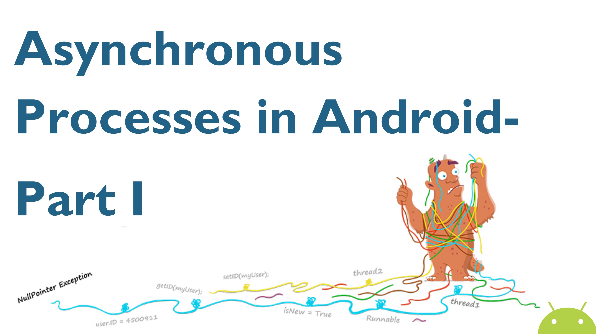
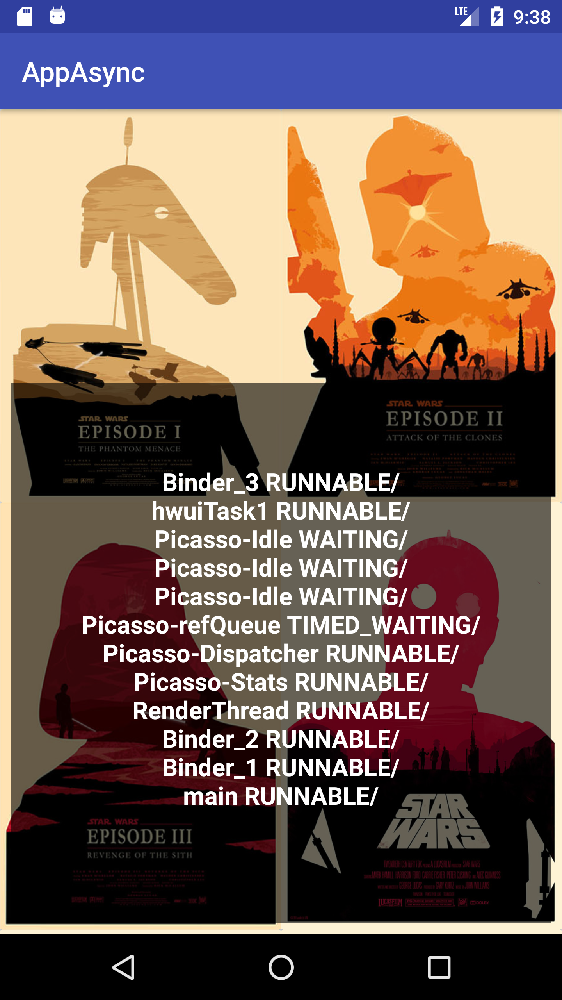
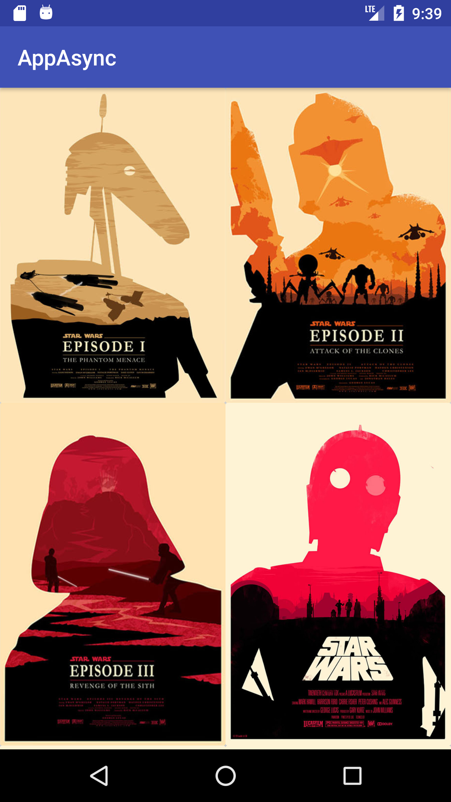

# android-asynchronous-processes
Asynchronous Processes in Android


## Demo
<span style="padding-left:30px;"></span> 

## Dependencies

- Guava 22
- Gson 2.8.1
- Picasso 2.5.2
- Jdeferred-android 1.2.6

```
   compile 'com.android.support:appcompat-v7:26.+'
   compile 'com.android.support.constraint:constraint-layout:1.0.2'
   compile 'com.android.support:recyclerview-v7:26.+'
   compile 'com.android.support:cardview-v7:26.+'
   compile 'com.android.support:design:26.+'

   compile 'com.google.guava:guava:22.0-android'
   compile 'com.google.code.gson:gson:2.8.1'
   compile 'com.squareup.picasso:picasso:2.5.2'
   compile 'org.jdeferred:jdeferred-android-aar:1.2.6'

   testCompile 'junit:junit:4.12'
```

## Slides

La presentación de la charla esta en el siguiente   [Link](https://docs.google.com/presentation/d/1Mv6aHN0Dh8-DHUwlREFbbBjnxPSLv-W3OJjJF5ZzNMw/edit?usp=sharing)

## Issues

Cualquier issue, duda o consulta lo puede dejar en este link [https://github.com/emedinaa/android-asynchronous-processes/issues](https://github.com/emedinaa/android-asynchronous-processes/issues) y lo atenderé a la brevedad.
